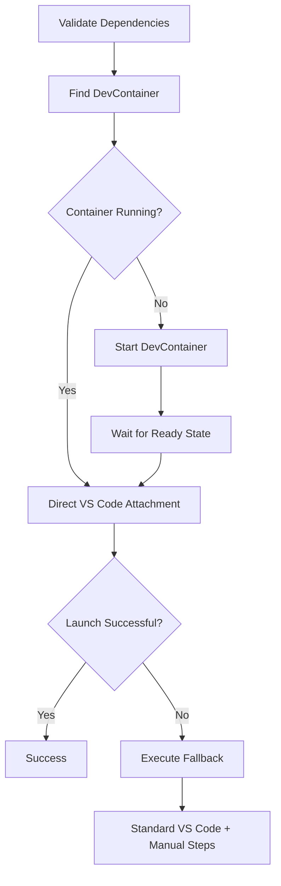

# DevContainer VS Code Launch Scripts

This directory contains scripts for launching VS Code directly into running DevContainers, providing a streamlined developer workflow similar to GitHub Codespaces but for local development.

## Scripts

### `vscode-launch.sh`

**Primary script for launching VS Code directly into a DevContainer.**

**Usage:**
```bash
# Launch in current directory
./scripts/devcontainer/vscode-launch.sh

# Launch in specific project directory
./scripts/devcontainer/vscode-launch.sh /path/to/project

# Launch with debug output
./scripts/devcontainer/vscode-launch.sh --debug

# Force restart container before launch
./scripts/devcontainer/vscode-launch.sh --force-restart

# Preview actions without execution
./scripts/devcontainer/vscode-launch.sh --dry-run
```

**Key Features:**
- **Hybrid Container Management**: Combines DevContainer CLI reliability with direct attachment speed
- **Smart Container Detection**: Multiple detection strategies for robust container discovery
- **Comprehensive Error Handling**: Graceful fallbacks when direct attachment fails
- **Cross-Platform Support**: Works on Linux, macOS, and Windows/WSL
- **Integration with Existing Infrastructure**: Follows established patterns from ai-code-forge project

## How It Works

### 1. Container Detection Strategy

The script uses multiple strategies to find running DevContainers:

1. **DevContainer CLI Detection** (primary): Uses official DevContainer CLI for reliable detection
2. **Label-Based Detection** (secondary): Searches containers by DevContainer labels
3. **Name Pattern Matching** (fallback): Matches container names with repository name

### 2. VS Code Attachment Process



### 3. URI Construction

VS Code is launched using the remote container URI scheme:
```bash
code --folder-uri "vscode-remote://attached-container+<container-id>/workspaces/<project>"
```

## Requirements

### Essential Dependencies
- **Docker** (v20.10.0+): Container runtime
- **VS Code** (v1.60.0+): Editor with Dev Containers extension
- **Git**: Repository detection and management

### Recommended Dependencies
- **DevContainer CLI**: `npm install -g @devcontainers/cli`
  - Provides reliable container lifecycle management
  - Required for starting new containers
  - Falls back to manual instructions if not available

### VS Code Extensions
- **Dev Containers** (`ms-vscode-remote.remote-containers`): Required for DevContainer functionality
- **Claude Code** (`anthropic.claude-code`): Enhanced development experience (pre-configured)

## Configuration

### DevContainer Requirements

Your project must have a properly configured DevContainer:

```json
{
  "name": "Your Project",
  "image": "mcr.microsoft.com/devcontainers/base",
  "workspaceFolder": "/workspace",
  "runArgs": [
    "--label", "my.repositoryName=${localWorkspaceFolderBasename}"
  ]
}
```

**Important**: The `runArgs` with repository labeling is crucial for container detection.

### Environment Variables

The script respects these environment variables:

- `DEBUG`: Enable debug mode (`true`/`false`)
- `VSCODE_DEVCONTAINER_TIMEOUT`: Container startup timeout in seconds (default: 30)

## Integration with Existing Scripts

### Worktree Integration

The script integrates with the existing worktree infrastructure:

```bash
# Launch DevContainer in specific worktree
./scripts/worktree/worktree-path.sh my-feature | xargs ./scripts/devcontainer/vscode-launch.sh
```

### Claude Code Integration

Works seamlessly with the existing `launch-claude.sh` script:

```bash
# Start DevContainer, then launch Claude Code
./scripts/devcontainer/vscode-launch.sh
./scripts/launch-claude.sh
```

## Troubleshooting

### Common Issues

**1. Container Not Found**
```bash
❌ ERROR: No running DevContainer found for project-name
```
**Solution**: Ensure DevContainer is running or use `--force-restart` to start it.

**2. VS Code Launch Failed**
```bash
❌ ERROR: Failed to launch VS Code with container URI
```
**Solution**: Check VS Code installation and Dev Containers extension. Script will automatically fall back to standard mode.

**3. Permission Issues**
```bash
❌ ERROR: Docker daemon is not running
```
**Solution**: Start Docker daemon or check Docker permissions.

### Debug Mode

Enable debug mode for detailed troubleshooting:

```bash
./scripts/devcontainer/vscode-launch.sh --debug
```

This provides:
- Dependency validation details
- Container detection strategy logging
- URI construction information
- Command execution traces

### Manual Fallback

If automated launch fails, the script provides manual instructions:

1. Open VS Code normally: `code .`
2. Open Command Palette (Ctrl+Shift+P)
3. Run: "Dev Containers: Reopen in Container"
4. Wait for container setup to complete

## Advanced Usage

### Batch Processing

Launch multiple DevContainers:

```bash
find . -name "devcontainer.json" -execdir ../../scripts/devcontainer/vscode-launch.sh {} \;
```

### Custom Timeouts

For slow container startup:

```bash
./scripts/devcontainer/vscode-launch.sh --timeout 60
```

### Integration with CI/CD

Dry run mode for testing:

```bash
./scripts/devcontainer/vscode-launch.sh --dry-run
```

## Technical Architecture

### Container Detection Labels

The script searches for containers with these labels (in priority order):

1. `devcontainer.local_folder=/absolute/path/to/workspace`
2. `my.repositoryName=repository-name`
3. `devcontainer.config_file=/path/to/devcontainer.json`

### Cross-Platform Considerations

**Linux/macOS**: Direct Docker socket access
**Windows/WSL**: Docker Desktop integration
**Paths**: Automatic normalization for container mounting

### Error Recovery

The script implements multiple fallback levels:

1. **Direct Attachment**: Fast container attachment via URI
2. **DevContainer CLI**: Official tooling for container management  
3. **VS Code Standard**: Open normally with manual container instructions
4. **Manual Instructions**: Step-by-step user guidance

## Contributing

When modifying the VS Code launch script:

1. **Follow Existing Patterns**: Use color-coded output and error handling from other scripts
2. **Test Cross-Platform**: Verify functionality on Linux, macOS, and Windows/WSL
3. **Maintain Fallbacks**: Ensure graceful degradation when components are missing
4. **Update Documentation**: Keep README synchronized with script changes

### Testing

Test the script in various scenarios:

```bash
# Test with existing container
./scripts/devcontainer/vscode-launch.sh --debug

# Test container startup
docker stop $(docker ps -q --filter "label=my.repositoryName=ai-code-forge")
./scripts/devcontainer/vscode-launch.sh --debug

# Test fallback modes
./scripts/devcontainer/vscode-launch.sh --fallback manual --debug
```

## References

- [VS Code DevContainers Documentation](https://code.visualstudio.com/docs/devcontainers/containers)
- [DevContainer CLI Reference](https://containers.dev/implementors/cli/)
- [Docker Container Labeling Best Practices](https://docs.docker.com/config/labels-custom-metadata/)
- [VS Code Remote Development](https://code.visualstudio.com/docs/remote/remote-overview)